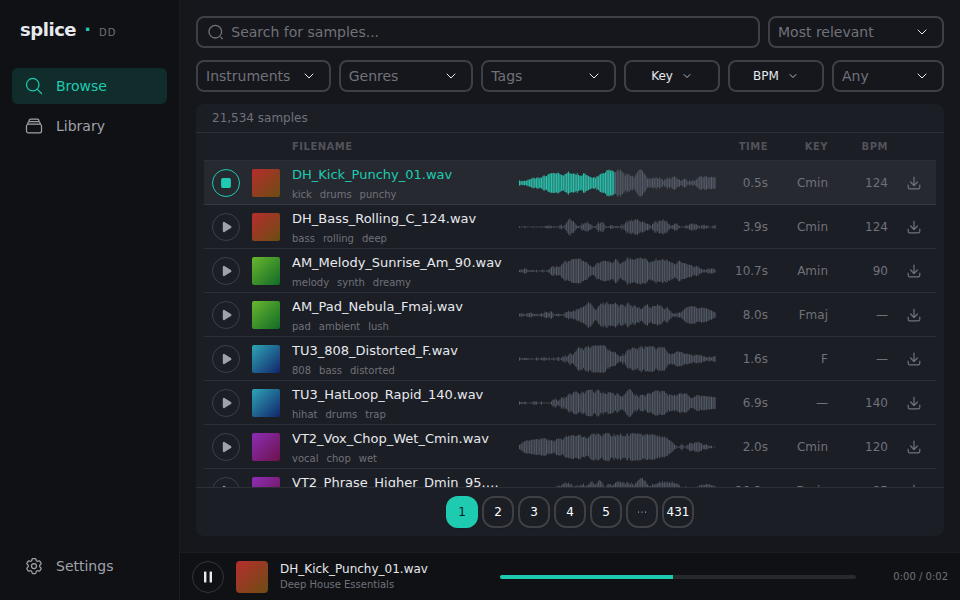

#  splicedd

**Splicedd** is an alternative desktop frontend for the [Splice](https://splice.com/features/sounds) sample library that requires no authentication. This fork rebuilds it as a **compact, plugin-style app modeled after the 2019 Splice desktop client**: a dark left sidebar, dense result rows with inline waveforms, and a window small enough to sit next to your DAW.

Based on the original [ascpixi/splicedd](https://github.com/ascpixi/splicedd).

<p align="center">
  
</p>

## Features

- **Browse** — search Splice with filters for BPM (exact or range), key & scale, genres, instruments, tags, and one-shots vs. loops
- **Instant preview** — hovering pre-fetches the sample; clicking plays it; click the **waveform** to seek (it fills teal with playback progress, 2019-style)
- **Playbar** — a bottom bar shows the current sample with play/pause, seeking, and elapsed/total time
- **Download & drag** — download a sample with the per-row button, or drag it straight into your DAW; either way it's decoded and saved as a `.wav` into your sample folder
- **Library** — local sampling management: browse everything you've downloaded, grouped by pack, with preview, drag-into-DAW, and delete-from-disk
- Compact 2019-Splice-style dark UI (960×600 default window)

## Getting started (development)

Prerequisites:

- [Node.js](https://nodejs.org) 18+ and [Yarn](https://classic.yarnpkg.com)
- [Rust](https://rustup.rs)
- Tauri v1 system dependencies — see the [Tauri prerequisites guide](https://tauri.app/v1/guides/getting-started/prerequisites) (WebView2 on Windows, `webkit2gtk` on Linux, Xcode CLT on macOS)

```sh
yarn install      # install dependencies
yarn tauri dev    # run the app (the first run compiles Rust — takes a few minutes)
```

On first launch, set a **sample path** in the setup dialog. This is the folder dragged-out samples are saved to, and the folder the Library tab manages.

Other commands:

```sh
yarn test         # run the unit tests (Vitest)
yarn dev          # frontend only, at http://localhost:1420 (Tauri-backed features disabled)
yarn tauri build  # production installers, output in src-tauri/target/release/bundle/
```

## 快速开始（中文）

1. 安装 Node.js 18+、Yarn、[Rust](https://rustup.rs)，以及 [Tauri v1 系统依赖](https://tauri.app/v1/guides/getting-started/prerequisites)（Windows 需要 WebView2；Linux 需要 `webkit2gtk`；macOS 执行 `xcode-select --install`）
2. `yarn install` 安装依赖
3. `yarn tauri dev` 启动应用（首次运行会编译 Rust，需要几分钟）
4. 首次启动时在设置弹窗中选择一个**采样文件夹** —— 拖拽出的样本会以 `.wav` 保存到这里，Library（本地采样管理）标签页也管理这个目录
5. `yarn tauri build` 打包安装程序；`yarn test` 运行单元测试

## Project layout

- `src/splice/` — Splice GraphQL API client and preview-audio unscrambler
- `src/local/` — pure local-library logic (`groupByPack`, unit-tested)
- `src/ui/` — React UI: sidebar navigation, Browse and Library views, shared playback hook
- `src-tauri/` — Rust backend: sample file write/scan/read/delete commands

See [SKILLS.md](./SKILLS.md) for the full redesign specification.
